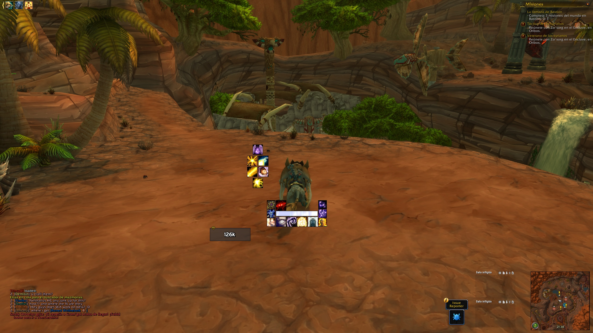

# TrincaUI
My personal layout for oUF with some extras. It is not very complex, but it has everything that I need.

```diff
! Please note I'm not actively playing, so updates will be scarce or non-existent.
```

## Description
  * Minimalist and simple interface using oUF. All dependencies are embedded, so no need to install any extra addon.
  * Most of the base code is taken from [ZorkUI](https://www.wowinterface.com/downloads/info24252-ZorkUI.html), and also I took some tricks from oUF_Farva. Overall, my intent was to mimic my own configuration of AfenarUI, but using plain oUF instead of going through ElvUI.
  * This is always work in progress, so functionalities may be missing and/or may never come. Testing comes from my own personal use, so hopefully it's enough.
  * All config is done in the `config.lua` file.
  * Except aura filters, those are on the `filters.lua` file.

## Dragonflight update
Make sure to follow [rRaidManager](https://www.wowinterface.com/downloads/info22236-rRaidManager.html) uninstall instructions if you get "blizzard compactraidframes" errors, and then /reload.

## Worthy additions
With the new revamp to Blizzard's UI and some new modules, I'm now only using the usual suspects:
  * WeakAuras2: Check [my own](https://wago.io/trincaui) or [Afenar](https://github.com/Afenar/AfenarUI)'s compilations.
  * Bigwigs/Littlewigs
  * Dialogue UI
  * BetterBags
  * Plater
  * Premade Groups Filter
  * LS:Glass
  * Details
  * OmniCD

<details>
  <summary>Blizz's HUD import (5120x1440)</summary>

  ```
1 39 0 0 0 5 4 UIParent -2.0 -555.7 -1 ##$$%/&&'%)$+$,# 0 1 0 8 2 MainMenuBar 0.0 4.0 -1 ##$$%/&&'%(#,# 0 2 0 0 0 UIParent 2135.3 -1137.7 -1 ##$$%/&&'%(#,# 0 3 0 0 0 UIParent 2588.9 -1100.1 -1 ##$%%/&&'%(%,# 0 4 0 0 0 UIParent 2135.3 -1097.7 -1 ##$$%/&&'%(#,# 0 5 0 1 1 UIParent -414.0 -2.0 -1 ##$%%/&&'%(#,$ 0 6 0 0 0 UIParent 2511.3 -976.0 -1 #$$%%/&&'%(#,$ 0 7 0 0 0 UIParent 2433.7 -976.0 -1 #$$%%/&&'%(#,$ 0 10 0 0 0 UIParent 1968.6 -1063.7 -1 ##$$&('% 0 11 0 0 0 UIParent 1970.9 -1063.7 -1 ##$$&('%,# 0 12 0 0 0 UIParent 1728.4 -1063.7 -1 ##$$&('% 1 -1 0 1 1 UIParent 6.0 -802.0 -1 ##$#%# 2 -1 0 8 8 UIParent -933.4 14.2 -1 #$$#%( 3 0 0 1 1 UIParent -300.0 -686.0 -1 $#3# 3 1 0 1 1 UIParent 302.0 -684.0 -1 %#3# 3 2 0 5 5 UIParent -2365.2 -271.8 -1 %#&#3# 3 3 0 0 0 UIParent 1532.3 -404.8 -1 '#(#)#-K.'/#1$3' 3 4 0 0 0 UIParent 135.3 -443.7 -1 ,%-5.)/#0#1#2( 3 5 0 2 2 UIParent -1480.7 -393.0 -1 &#*$3# 3 6 0 2 2 UIParent -1480.7 -503.0 -1 -#.#/#4& 3 7 0 0 6 PlayerFrame 16.0 16.0 -1 3# 4 -1 0 4 4 UIParent 0.0 -300.0 -1 # 5 -1 0 4 4 UIParent -0.0 -400.0 -1 # 6 0 0 1 1 UIParent -1098.0 -2.0 -1 ##$#%$&.(()( 6 1 0 0 6 BuffFrame 0.0 -4.0 -1 ##$#%$'/(()( 7 -1 0 8 2 ChatFrame1 25.0 64.0 -1 # 8 -1 0 5 5 UIParent -2913.4 -497.8 -1 #'$A%$&7 9 -1 0 0 0 UIParent 1681.7 -1061.7 -1 # 10 -1 1 0 0 UIParent 16.0 -116.0 -1 # 11 -1 0 8 2 MinimapCluster 0.0 4.0 -1 # 12 -1 0 1 1 UIParent 1080.5 -2.0 -1 #K$#%# 13 -1 0 0 0 UIParent 2708.2 -2.0 -1 ##$#%'&+ 14 -1 0 8 6 MinimapCluster -4.0 0.0 -1 ##$#%( 15 0 0 4 4 UIParent 0.0 587.8 -1 # 15 1 0 4 4 UIParent 0.0 566.3 -1 # 16 -1 0 2 0 MinimapCluster -4.0 0.0 -1 #( 17 -1 0 4 4 UIParent 0.0 -306.3 -1 ## 18 -1 0 1 1 UIParent 866.0 -1002.0 -1 #- 19 -1 0 4 4 UIParent 0.0 -274.7 -1 ##
  ```

</details>

<details>
  <summary>Blizz's HUD import (2560x1440) (old, may not work)</summary>

  ```
  0 30 0 0 0 7 7 UIParent -227.9 2.0 -1 ##$$%/&&'%)$+$ 0 1 0 7 1 MainMenuBar 1.2 4.0 -1 ##$$%/&&'%(#,$ 0 2 0 7 7 UIParent 226.8 2.0 -1 ##$$%/&&'%(#,$ 0 3 0 7 7 UIParent 768.7 2.0 -1 #$$%%/&&'%(#,$ 0 4 0 7 1 MultiBarBottomRight -0.8 4.0 -1 ##$$%/&&'%(#,$ 0 5 0 5 3 MultiBar7 -4.0 -0.1 -1 #$$%%/&&'%(#,$ 0 6 0 5 3 MultiBarRight -4.0 0.0 -1 #$$%%/&&'%(#,$ 0 7 0 5 3 MultiBar6 -4.0 -0.0 -1 #$$%%/&&'%(#,$ 0 10 0 4 4 UIParent 0.0 -503.0 -1 ##$$&('% 0 11 0 7 1 MultiBarLeft -230.2 4.0 -1 ##$$&('%,# 0 12 0 7 1 MultiBarBottomLeft -147.1 4.0 -1 ##$$&('% 1 -1 0 4 4 UIParent 0.0 -227.3 -1 ##$# 2 -1 0 5 5 UIParent -2.0 -472.0 -1 ##$# 3 0 0 3 3 UIParent 648.7 -165.2 -1 $#3# 3 1 0 5 5 UIParent -648.7 -165.8 -1 %#3# 3 2 0 5 5 UIParent -1253.2 -238.5 -1 %#&#3# 3 3 0 0 0 UIParent 23.9 -302.0 -1 '$(#)#-#.#/#1$3# 3 4 0 0 0 UIParent 20.6 -304.5 -1 ,#-#.#/#0#1#2( 3 5 0 2 2 UIParent -384.2 -170.2 -1 &#*$3# 3 6 0 2 2 UIParent -368.7 -176.2 -1 3# 4 -1 0 4 4 UIParent 0.0 -342.8 -1 # 5 -1 0 4 4 UIParent 0.0 -423.3 -1 # 6 0 0 1 1 UIParent -864.7 -2.0 -1 ##$#%$&.(()(*# 6 1 0 3 3 UIParent 2.0 411.4 -1 ##$#%$'+(()(*# 7 -1 0 3 3 UIParent 2.0 -303.5 -1 # 8 -1 0 3 3 UIParent 34.0 -504.2 -1 #'$A%$&7 9 -1 0 7 1 MultiBarBottomLeft -206.8 4.0 -1 # 10 -1 1 0 0 UIParent 16.0 -116.0 -1 # 11 -1 0 5 5 UIParent -2.0 -262.0 -1 # 12 -1 0 1 1 UIParent 947.2 -2.0 -1 #K
  ```

</details>

<details>
  <summary>Blizz's HUD import (1920x1080) (old, may not work)</summary>

  ```
  0 30 0 0 0 7 7 UIParent -227.9 2.0 -1 ##$$%/&&'%)$+$ 0 1 0 7 1 MainMenuBar 1.2 4.0 -1 ##$$%/&&'%(#,$ 0 2 0 7 7 UIParent 226.8 2.0 -1 ##$$%/&&'%(#,$ 0 3 0 7 7 UIParent 767.9 2.0 -1 #$$%%/&&'%(#,$ 0 4 0 3 5 MultiBarBottomLeft 4.0 0.0 -1 ##$$%/&&'%(#,$ 0 5 0 5 3 MultiBar7 -4.0 -0.1 -1 #$$%%/&&'%(#,$ 0 6 0 7 7 UIParent 689.8 2.0 -1 #$$%%/&&'%(#,$ 0 7 0 7 7 UIParent 612.2 2.0 -1 #$$%%/&&'%(#,$ 0 10 0 4 4 UIParent 0.0 -503.0 -1 ##$$&('% 0 11 0 7 1 MultiBarLeft -230.2 4.0 -1 ##$$&('%,# 0 12 0 7 1 MultiBarBottomLeft -148.8 4.0 -1 ##$$&('% 1 -1 0 4 4 UIParent 0.0 -227.3 -1 ##$# 2 -1 0 5 5 UIParent -2.0 -472.0 -1 ##$# 3 0 0 3 3 UIParent 648.7 -165.2 -1 $#3# 3 1 0 5 5 UIParent -648.7 -165.8 -1 %#3# 3 2 0 5 5 UIParent -1253.2 -238.5 -1 %## 3 3 0 0 0 UIParent 23.9 -302.0 -1 '$(#)#-#.#/#1$3# 3 4 0 0 0 UIParent 20.6 -304.5 -1 ,#-#.#/#0#1#2( 3 5 0 2 2 UIParent -384.2 -170.2 -1 &#*$3# 3 6 0 2 2 UIParent -368.7 -176.2 -1 3# 4 -1 0 4 4 UIParent 0.0 -342.8 -1 # 5 -1 0 4 4 UIParent 0.0 -423.3 -1 # 6 0 0 1 1 UIParent -864.7 -2.0 -1 ##$#%$&.(()(*# 6 1 0 3 3 UIParent 2.0 409.7 -1 ##$#%$'+(()(*# 7 -1 0 3 3 UIParent 2.0 -287.7 -1 # 8 -1 1 6 6 UIParent 35.0 50.0 -1 #'$A%$&7 9 -1 0 7 1 MultiBarBottomLeft -206.8 4.0 -1 # 10 -1 1 0 0 UIParent 16.0 -116.0 -1 # 11 -1 0 5 5 UIParent -2.0 -259.5 -1 # 12 -1 0 1 1 UIParent 947.2 -2.0 -1 #K
  ```

</details>

<details>
  <summary>OmniCD profile (Heal)</summary>
  
  ```
TE12UTTrq0FL(b0wSZS3Fm(wIbcumcvaA6deLsALnrOjfiPIV8q)27S7SuIXrPTjTWWqJ3D2zpZzN5mYLq5YYIxhAd9vnrZTDTJdrJHXQX9dNv1NwTP62YI39HLV96fxYovwC5J76dddpu9e5D9ZHYfGPKwVB3yDxBX9vnPiM3sFIJr)vv7676((VJ61DTtW9FcjZaH7KGi(tXnv9JpfDD3Kr4XX(kIas0rFv9gYwhTVVQDFvZnDF1gpvELXAab6SoVY4bNQC7VOuLfps7ieG3PfwR040wtChjF37Q2SPU92FJqib11vnHKvt1tD7PTjcQ(zc20lurFytDFy9y5QYI2Q7dLfN311SP7H2HYI9T1JXxSZOuF72HWifrmEbzq6(wO3LrVgDkensH17au5IyuNqVti0GYi8wqATE8i6pgEmXATvRAcBIy42(UhEBy7y0(ykQMsXRSgTbaV0y0O3PICLwE60ExF3TXhSy2rz(6UM93tz8c3el8QUl)Z)48ZhoD(HhYpa9aLcEP2jLMJVokVY6O3f0zO9SI4oiNDnDR)0Xe6d7EOQp9xJ97BxxngUMQfxebrm1Y55h)sIx(cM5yipfALz0QSAjyjM3daHp1C0kLwN2PmgLWjNJ25K(FFP0l4uMhFpbbIiVyyg6H5OF1PXmmXWsHZawuRiqlncUojIznqPJZAbT3OSm3)vm8SY7J3V6fS3PUF1eNP1oQptl8EQpu4oE)oPc9iIkd96tnJ)F1)DryBODO(ZH)fnGMVvdO5)G8b)SFucF4UUhUHWEO)YhzECyxOP5Q(iCxszMaTEzeylucpgnvLlOIEeu8QAL0Lwe8gTwNnr6nlAHOtO8jtJc5dBP2xG9Zzqt6izzAEActQIF1tYjBcd0SLEQ15vRhjIJORmfD(ffrVPyqvkrwuzTox0GsAp1vgTyGswOWcMKBKyfg)e8t7jbJbIggVIpMffkx(ygxoakbKwZ75J7vAoqwVqNcnaKZPDPxetYzsi0loSxksGoQyMUhjkmzCc2SBEjVjiPYppF1AoQGqyyVeivHY(RTAg0uTGKrgDaMiSkudCiqslMjV7QV9Ug63Xi9DBt3dNTF72LpTlKyFQwKlrtohl47gQNgnwnowT(UYILV7M3E5vlNQC)yQfywv8SUe8WC74PE)1V(nX5MKwsyCwCMlsFuwueV)T5AXIXQ2pDObkjGUE)Wy39PYQz4ErQSzUF005qFBvZPonKl)M3PTao2IjaLZAqshG6e(IwmufFGmsfvVDqHyb(JFu9p8rN6BtVGAnkL5soRqhvFOkozQ2JArX4cZk(rGek4IkNcYLJGK6Qt(PTSBwxejRsUHCfkn83WTjkHkw1Ukws78jdWAmPprVvNcpPNtxeTuusrG85sAkNLqOxL2ej9HeE0oAqFAjHWXLXuRRI6tO1ObW2uQHXbe6C1UKHJKQ69CZo1sNqTeC52eQneyoWjTmBi9rzUukjPX(8bScjlNacJtMwtRZDDXPTMjYGBCtAhPvskMCSKq(HqHmX6KOj3ktSiFan9uNYej14MwbO5Fg(GEIesRfhdISBAfNkKGekD5lqKtfebwMIGkQ0mK8yMyi1fM1aJuYVtjT6CVEBxB43PFlcJJul40xWnP3onbAs39GwKxqHnfH5twEofMgA8hniohNxOMSFBzXQM6NFEM2H47x74ReLoiMi)YgJjiFIHnaN)FUEOEvDtn)L6JSrmdR6PVqrKRs0Wzh(pee5bQLV7(26ZVaP)jMFEzFn9f9(W1)0Bcvn)f
  ```
  
</details>

<details>
  <summary>OmniCD profile (DPS)</summary>
  
  ```
TE12UTTrt4xL(a0wSZSNVmXhsnqGIrOcqtVGO0su2eHMuGKk(Wf9zVZm7slghNGM8)BdbnE3zN97BoUUekxxw8M6U6HQwwCxF30ilmovnDy81vdYQTvxxw8UpS(TxS6SKsLfND)(H6XX7QEG0U5X6YvGRKwVF)utFxXTvTpzXxuzlRCv3MB6)XVJMn9DFxJVajFx9cKE8Vfxwnm9aR6(zH67NgQihG4ogQA2sYwzJUQRAR3w(6sIKDhQAVS)R05HYZDEhOWGpenUiemL7(nJPS4EAhLcIbRY71UG174D0jySVA72MUR)tcAeg3u1wlsTvp0FG2M8vnpsCHcwfd1BBgQ3mvEvzrx1T1LfN033UT)UUXYIdDntCWJWy)UDJ1tKfr(cYGmWG8LqFiJElgmi60kFmaOjWy0kOpOuwW4urpO9(iEe9hnp(m)01d93926DtS8rkAMP45EN1bqu7CwmgmSVYQFzAVFO)AokYS7QxMd4mh0E0GkRoeS0pWXiGjA8bxaOGq0brzhmXGKR8v9N9p)9jNqEYn9ThULCPRceE638PJe6d7VRAq(RPHdDBQMQVGslxXNNPwMNF8lD86N5zoAYxIj6mtmERg8KNpcaHDZsMO1(GnyCoJkOvlyYsN(3pv6z(0Kl49eeiFWPJlqpSe9FdVp8K3xfCGhTgc0ANkLNWy2ceDcEpyJodvdSaZhDhlsVpE)MVvARz2rzTbQ4IcRrQ4tfoEPbTbJiIgNMYZuQ)Fv0DA9U6UXMpx)FOQZ9TGV7)HEgcfUP56BAPptSHUUT)UxFy3U1pSVwUfcmjmsituFCFDBRSL1IAndyis5vHKKhbdlz9rTi4i1ykRrGGGOe48kRSMf06alrTlCjtqPKOpYRbQagG0jmOJfmkJMwIpQoefbW7CY3y0BfLP0d6IyJsyqHPZfXOoJROr2e9bJGhBG6BilPubB6cPGTxXRr16EbRG1eeRQ9gDgQOLiSirn8mjkXngKLCbdimhcAF2hevm3ODrTfHyYCkQjJCPkxqlRzTKbf14K8eRuK5s(aQciXy2y68MOxL8urInIDdA0fN3nOsGlQfuI6ikRaavrjMvB9qIYaxyHj1SMeBmka1HCSqzN3vd5eaR3K8iia5mbul2fbNwNIuuqqCC5PWPhlKQzu)EKgrSTEKE6Wa1o8vBMMZ5Ke9toTG1gcoQ6p5f8jVg5NJjUtmiN8HkpLJXs0aimbN590GZjXyx0KoMhvP4jDmkOLKiclRftHlfstSs03XdzMLKDPcoNOmnClMcd(OY6x4w51S88qznnQeFdOPEkPyefzsBsdDm5WgMZcaLYLJUwFo7Ik1ZUE6a5chdMZEPuClMCElBzSco2Rqbu6SJYd0Cg5YEf0CpMqAd5zFQv3k8N)O2F6JYny7hBMFkw10u1MBklw)UlF7zNVEUt5hLwUl6AUORm(07e5t9(lEZFSMNzvtQUWolhuFC2RIV)DdCRAsNPQUp9udBzk9MdJt93II8X2KRK84L6rVgSEORQ9LonWY8a3JVJE8M(7UKgGupC29Pjysl3ZZazvUxgDUv5m(vmgSuNrzrisTCTzrUiuKco0Lw0zW0HP(Fg5(xHu)bkPtGc)oM(U6)I(uupnrUI5h2kfIZtEMliJkQPYYK0VKmpkMPLg7rJMZ25zr1d7klUQT5Xhxedv)4XWVk54PGQ(lhBTaOpVleK4)NBgBUQPTj9y(Qb6vlYqBIlmtZV)xLhGw(UB7Ao5uK(Nw(11dn0R5(Wf)YPxw8V)
  ```
  
</details>

## Other notes
Special thanks to Zork, scrable and Afenar for the inspiration and code that I based this on.
Also definitely feel free to give feedback, propose changes, or fork to your own project.


